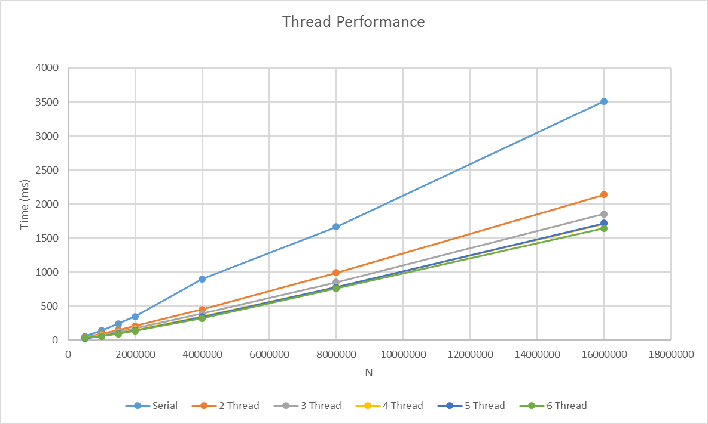

# #1 OpenMP
Eratosthenes paralellisation using OpenMP

## Test
Environment Ubuntu 16.04 on Oracle VM VirtualBox with processor set to have 6 cores.
Each test was run 10 times, the median is then taken.

## Results
Graph is presented here

Or take this [raw result](docs/output.csv) for you monsters.

## Usage
Simply give these script ([compile](compile.sh) and [run](run.sh)) appropriate permission and run them.